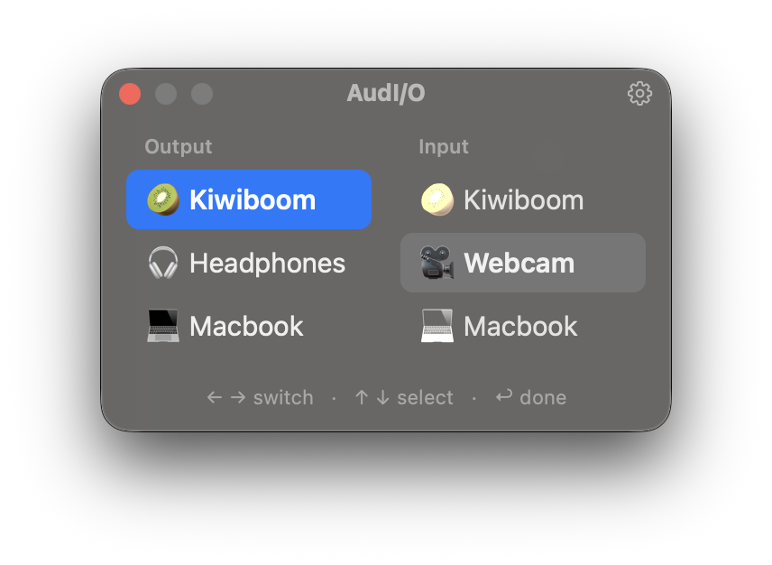
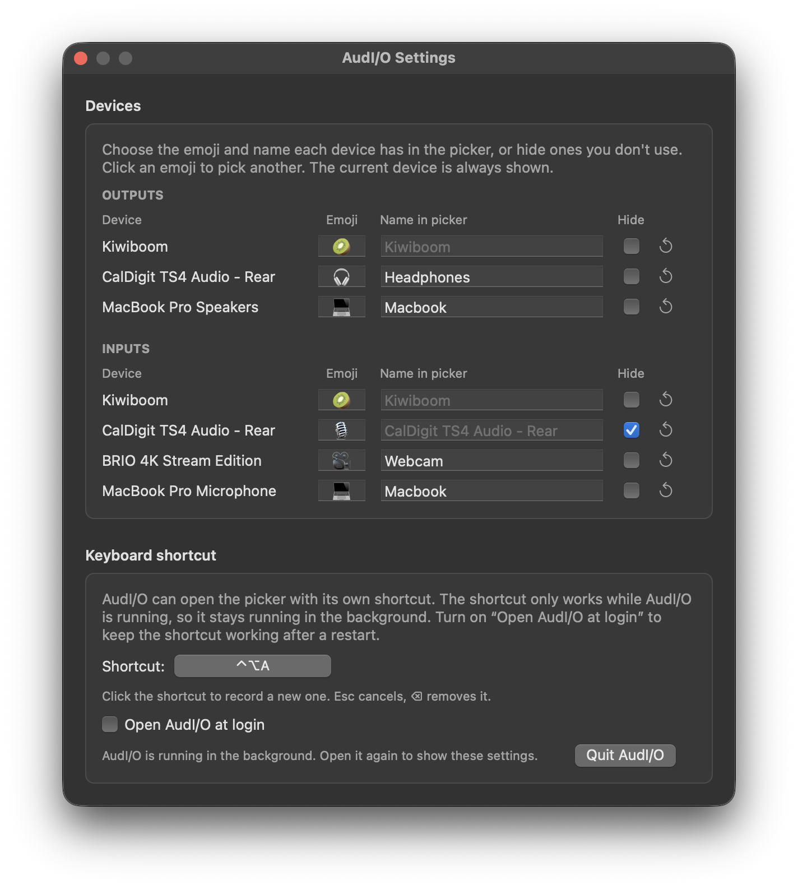

# AudI/O

A tiny macOS app for switching audio output and input devices from the keyboard.

<p align="center"></p>

In the picker:

- **← / →** switch between the Output and Input columns
- **↑ / ↓** switch device immediately
- **Return / Esc** (or clicking elsewhere) closes the picker
- **⚙︎ / ⌘,** opens settings

## Install

Download `AudIO-<version>.zip` from the [latest release](https://github.com/rorystephenson/audio/releases/latest),
unzip it and move **AudIO.app** to Applications. It's signed and notarized. Requires macOS 13 or later.

## Settings

Give each device its own emoji and name in the picker, or hide ones you never use (the current device
is always shown). Settings are remembered per device, including while it's unplugged. ↺ resets a device.

<p align="center"></p>

There are two ways to open the picker:

- **AudI/O's own shortcut** (⌃⌥A by default). AudI/O keeps running in the background, with no
  Dock or menu bar icon, and can open at login. Open the app again to show settings.
- **Another app's shortcut** (Raycast, Karabiner, skhd, …). Remove the shortcut in settings (click it,
  then ⌫) and have your tool run `open -a AudIO`. Launching AudI/O then shows the picker, launching it
  again closes it, and it quits once the picker is closed. Use `open -a` rather than running the
  binary inside the app directly, so a second launch reaches the running copy.

## Building

```sh
./scripts/build.sh            # → build/AudIO.app and build/AudIO-<version>.zip
VERSION=1.0.0 ./scripts/build.sh
```

For development, `swift run` launches the bare binary.

### Signing and notarizing

`build.sh` signs with the first **Developer ID Application** identity in your keychain, or ad-hoc
signs if there isn't one (fine locally, but other people will get Gatekeeper warnings).

To notarize, store App Store Connect credentials once:

```sh
xcrun notarytool store-credentials AudIO --apple-id <apple-id> --team-id <team-id>
```

then build with:

```sh
NOTARY_PROFILE=AudIO ./scripts/build.sh
```

This notarizes and staples the app, and the resulting zip can be shared.

## License

MIT, see [LICENSE](LICENSE).
